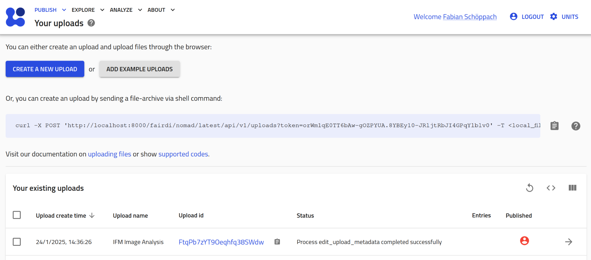
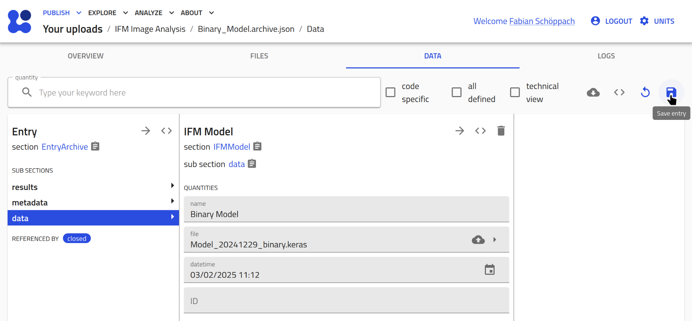
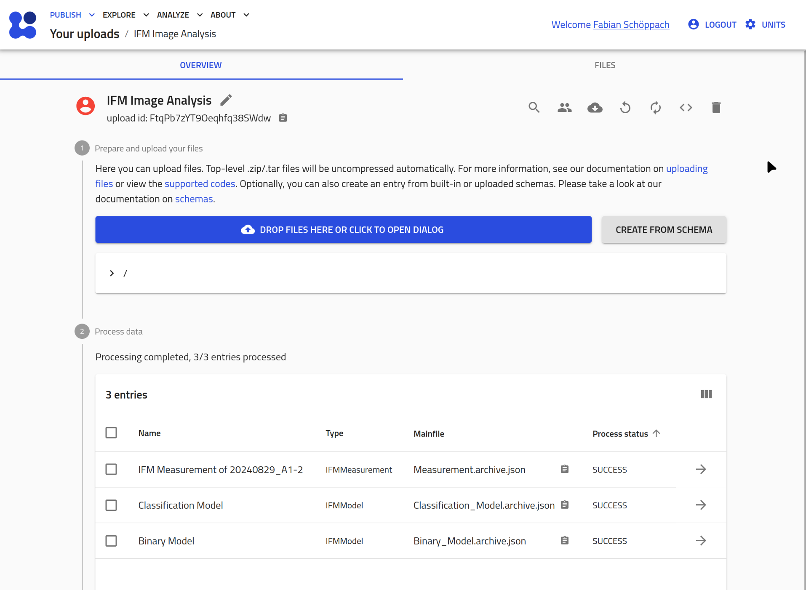
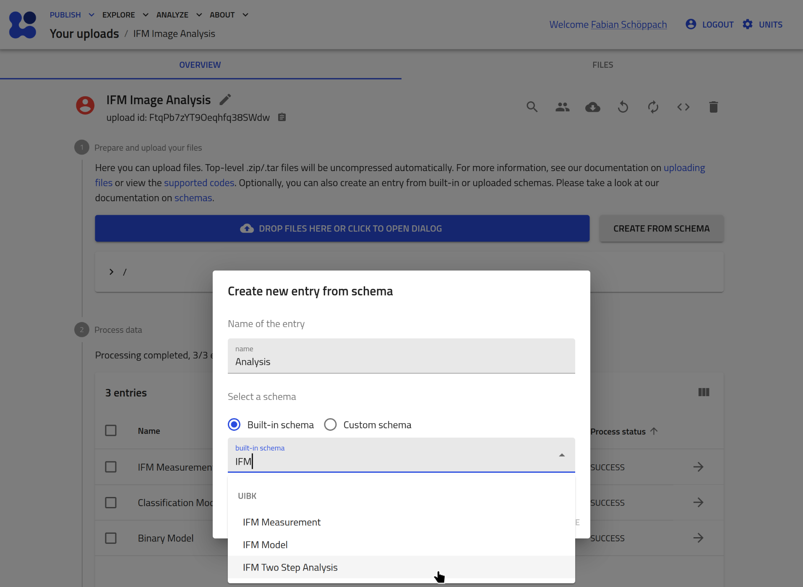
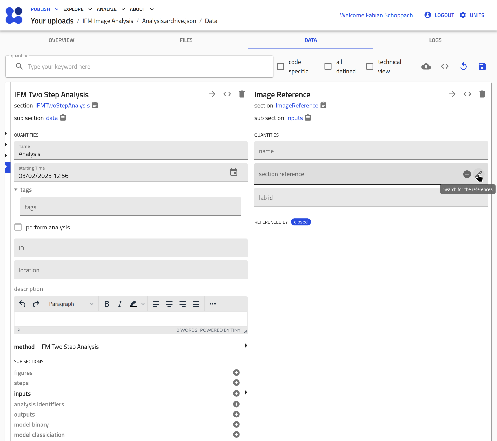
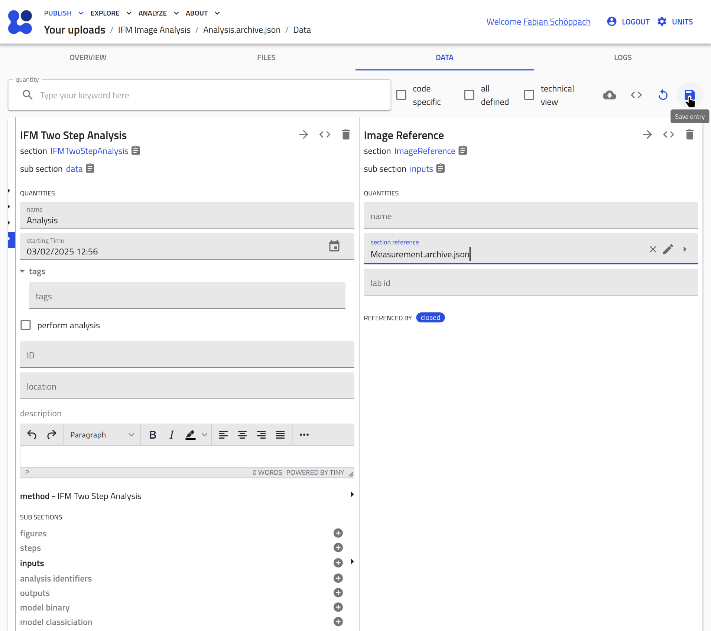
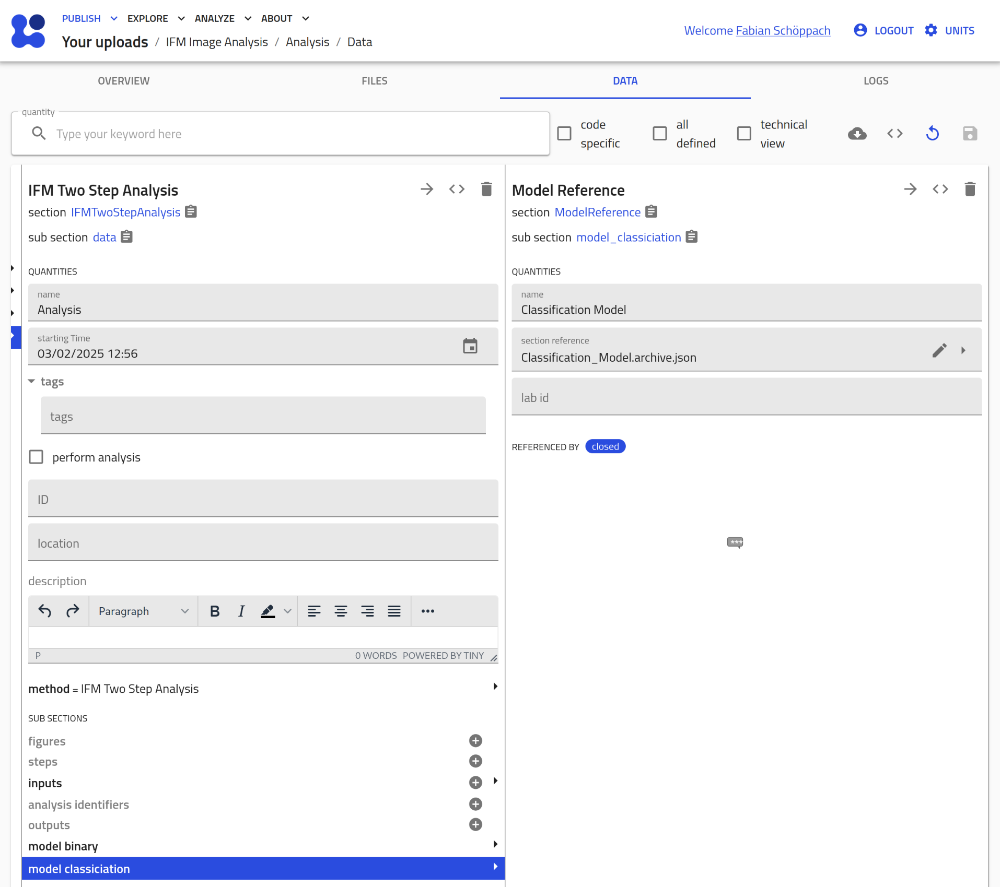
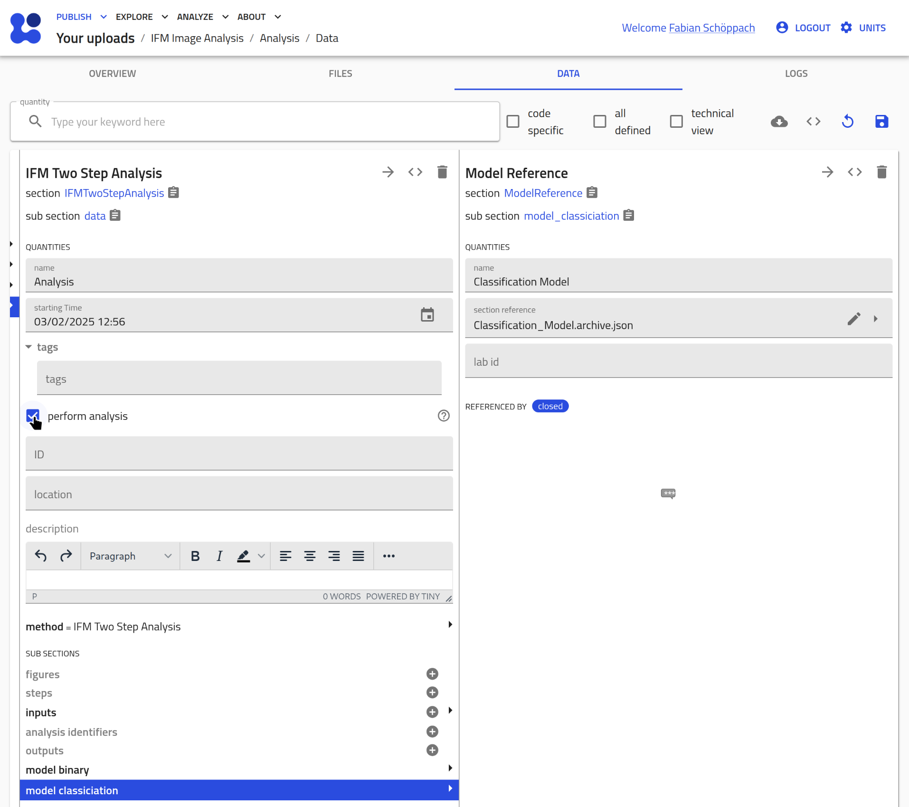
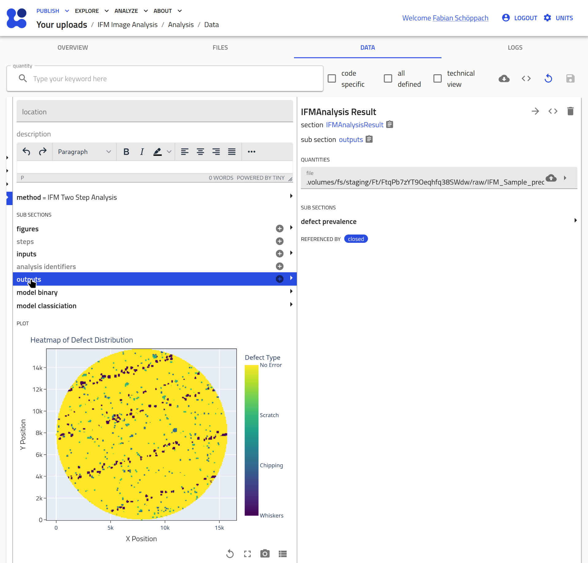

# Using Automated Defect Analysis on IFM Images

This tutorial is to demonstrate how to perform an automated defect analysis on IFM images.  
To execute the analysis, there need to be three NOMAD entries present: 

* an IFM Measurement type entry with associated microscopy file
* two IFM Model type entries, each with the respective `.keras` model file

Depending on your knowledge and on which entries you have already present, you may jump ahead to the [IFM Analysis](#ifm-analysis) subsection. 

## Uploads

1. **NOMAD Uploads page**:  
    Navigate to your Uploads page, reachable under `PUBLISH > Uploads`.
2. **Enter upload**:  
    You might need to create a new new upload using  or edit an existing one.  
    

## IFM Measurement Entry

1. **Create a new entry**:  
    Create a new entry via the button `Create from Schema`.  
    
    Give it a name and select `IFM Measurement` as type.  
    
2. **Assign the measurement files**:  
    You should now see the data section of the created entry. Assign an image and a metadata file.  
    
    Don't forget to click the save button in the top right corner afterwards!  
    
3. **Automated XML Parsing**:
    As soon as a XML file is assigned, the plugin extracts metadata from it, such as:
    * exposure time
    * start and end time
    * magnification

    
    If you have a `UIBKSample` entry already present with the same `lab_id` as extracted from the XML file, the entry automatically creates a reference to it.  
    

## IFM Model

Perform the same steps as above for creating two `IFM Model` entries:

1. **Create a new entry**:  
    Create a new entry via the button `Create from Schema`.  
    
    Give it a name and select `IFM Model` as type.  
    
2. **Assign the measurement files**:  
    You should now see the data section of the created entry. Assign an image and a metadata file.  
    
    Don't forget to click the save button in the top right corner afterwards!  
    
3. **Automated Parsing**:
    As soon as the `.keras` file is assigned, the plugin extracts metadata from it, such as:
    * model type (binary/classification)
    * number of layers
    * number of parameters

    
   

## IFM Analysis

At this point, your NOMAD upload should contain at least one `IFMMeasurement` entry and two `IFMModel` entries:

To perform the analysis on this measurement perform the following steps: 

1. **Create a new IFMAnalysis entry**:  
    
2. **Assign the measurement entry**:  
    Create a new `input` section by clicking the plus icon:  
      
    Click on the pen icon to assign an existing entry:  
      
    Select the IFMMeasurement entry you want to analyze:  
      
    Save this change:  
      
      
3. **Assign the models**:
    Repeat the steps from above to assign both `IFMModel` entries as well:  
      
4. **Check 'perform analysis'**:  
    By opting the 'perform analysis' checkbox (and saving) the image analysis is triggered:  
      
5. **Results**:
    Execution of the code can take up to several minutes.
    Results are stored in a csv file that is referenced in the `output` section of the `IFMAnalsis` entry:  
    
    From these results, a heatmap of the spatial distribution of detected defects is generated, and the prevalence of classified defects is calculated.  
      

